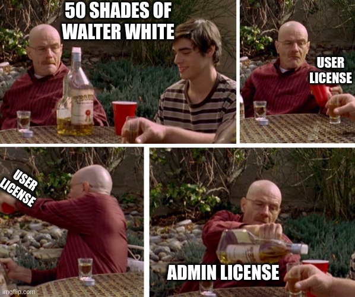

# FCSC 2024 Fifty Shades of White (Junior)

Le grand Walter White a écrit un programme lui permettant de restreindre l’accès à ses données “professionnelles”. Il distribue des licenses au compte-gouttes, mais vous avez néanmoins récupéré une license qu’il a générée pour son fils ! Son système propose deux niveaux de licenses : celle que vous avez récupérée est la moins privilégiée, et vous souhaitez obtenir une license “admin”.

Le programme ci-joint vérifie entre autres le niveau de privilèges de la license, et vous récompense si vous présentez une license “admin”.

[L’abus d’alcool est dangereux pour la santé.](https://www.santepubliquefrance.fr/determinants-de-sante/alcool/articles/quels-sont-les-risques-de-la-consommation-d-alcool-pour-la-sante)

Fichiers :
- [fifty-shades-of-white](fifty-shades-of-white) (Application)
- [license-walter-white-junior.txt](license-walter-white-junior.txt)

Auteur : [Cryptanalyse](https://twitter.com/Cryptanalyse)

Origine : [Fifty Shades of White (Junior)](https://hackropole.fr/fr/challenges/reverse/fcsc2024-reverse-fifty-shades-of-white-1/)

-----------

## Connectez vous en WEBSSH
> http://localhost

#### tentez 
> nc fifty-shades-of-white.cyrhades.fr 4000

-----------

## Ou directement avec netcat
> nc localhost 4000

-----------

## Installation manuel
Vous n'utilisez pas l'application **les CTFs de Cyrhades** ? C'est dommage !
Mais voici comment installer ce CTF manuellement :

> git clone https://github.com/Hack-Oeil/fcsc2024-reverse-fifty-shades-of-white-1.git

> cd fcsc2024-reverse-fifty-shades-of-white-1

-----------

## Sur le site officiel hackropole.fr
> https://hackropole.fr/fr/challenges/reverse/fcsc2024-reverse-fifty-shades-of-white-1/